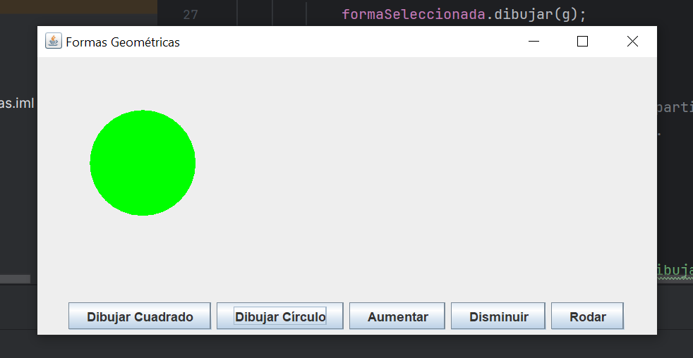

<div align="center">
   
# Practica POO de formas Geométricas en Java 🟢🟦

</div>

## Descripción del Proyecto
Este proyecto es una aplicación de escritorio en Java que permite crear e interactuar con formas geométricas, como cuadrados y círculos, mediante una interfaz gráfica de usuario (GUI). 
La aplicación utiliza las librerías AWT y Swing para manejar eventos y crear componentes de la interfaz. 

El objetivo principal de este proyecto es implementar y aplicar los principios de la Programación Orientada a Objetos (POO) para consolidar los conceptos aprendidos. 

## Características

- **Dibujo de Formas**: Los usuarios pueden seleccionar y dibujar cuadrados y círculos en la interfaz gráfica.
- **Redimensionar**: Las formas pueden ser aumentadas o disminuidas en tamaño.
- **Rotación**: Los círculos pueden ser rotados, implementando la interfaz `Rodable`.

## Principios de Programación Orientada a Objetos Aplicados

- **Encapsulamiento**: Cada forma (Cuadrado, Círculo) tiene sus propios atributos y métodos, asegurando que la implementación de una forma no afecte a las demás.
- **Herencia**: Las clases `Cuadrado` y `Circulo` heredan de una clase base `Forma`, reutilizando código y evitando duplicación.
- **Polimorfismo**: En este proyecto, podemos manipular diferentes tipos de formas, como **Cuadrados** y **Círculos**, de manera uniforme a través de métodos comunes en la clase principal. Por ejemplo:
  - Podemos llamar al método `dibujar()` en ambas formas sin preocuparnos por el tipo específico.
  - El método `redimensionar()` se puede utilizar para aumentar o disminuir el tamaño de cualquier forma, aunque el comportamiento exacto sea diferente.
  - El método `rodar()` solo se aplica a formas que pueden hacerlo, como el **Círculo**, lo que permite un código más limpio y organizado.

- **Interfaz**: Se utiliza la interfaz `Rodable` para definir un comportamiento que solo aplica a las formas que pueden rotar, en este caso un circulo pero podria ser escalable a otras formas que rueden.
- **Abstracción**: La clase Forma actúa como una clase abstracta que define un conjunto de métodos que deben ser implementados por las clases hijas (Cuadrado y Círculo). 

## Tecnologías Utilizadas

- **Java**: Lenguaje de programación utilizado para el desarrollo de la aplicación.
- **AWT y Swing**: Librerías de Java para la creación de la interfaz gráfica.
- **IntelliJ IDEA**: IDE utilizado para el desarrollo del proyecto.

## Instalación

Sigue estos pasos para ejecutar el proyecto en tu máquina local:

1. Asegúrate de tener instalada la versión 17 de [Java JDK](https://www.oracle.com/java/technologies/javase-jdk17-downloads.html).
   
2. Clona este repositorio en tu máquina local ejecutando el siguiente comando en tu terminal:
   ```bash
   git clone https://github.com/StefiGil/PracticaPOO_FormasGeometricas.git

3. Navega al directorio del proyecto:
   
   ```bash
   cd PracticaPOOFormasGeometricas
   
5. Abre el proyecto en el IDE que utilices.

6. Asegúrate de que el IDE esté configurado para usar Java 17.

7. Compila y ejecuta el proyecto desde tu IDE.

## Interfaz del Proyecto en Acción 🚀

<div align="center">



</div>
